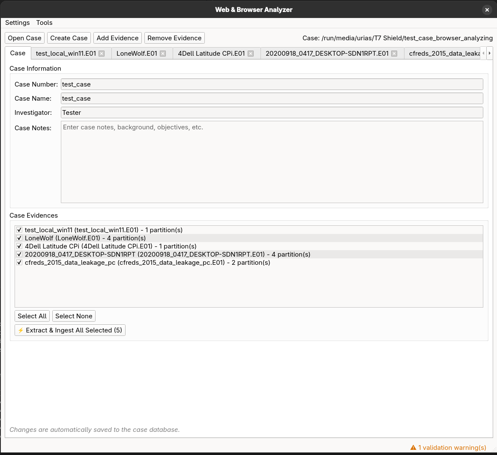

<p align="center">
  
</p>

# SurfSifter

A cross-platform forensic workstation for analyzing browser artifacts, cached media, and OS evidence from disk images (E01/EWF format). Built with PySide6, providing native GUI for extraction, analysis, tagging, and reporting without modifying source evidence.



## Status

**v0.3.1-beta** — Feature-complete core functionality, actively tested. [Download pre-built releases](https://github.com/gaestu/surfsifter/releases) or build from source.

## What It Does

SurfSifter is a forensic triage workstation that helps investigators:

- **Extract** browser artifacts (history, cookies, cache, etc.) and image files from E01 disk images without modifying evidence
- **Analyze** recovered artifacts through specialized viewers: browse URLs chronologically, cluster similar images by perceptual hash, review browser sessions, examine system indicators
- **Correlate** findings using timeline fusion (13+ artifact sources), URL pattern matching against reference lists, and hash-based file intelligence
- **Report** results via customizable PDF reports with forensic screenshots and tagged findings
- **Browse safely** — All extraction happens offline; optional sandboxed browser preview (firejail) for controlled URL inspection

Designed for Windows evidence on any platform (Linux/macOS/Windows host).

## Quick Start

### Option 1: Linux Installer Script (Recommended)
No repository clone is required. Run the installer directly as a one-liner:
```bash
wget -qO- https://raw.githubusercontent.com/gaestu/surfsifter/main/scripts/install.sh | bash
```

### Upgrade
Canonical update command:
```bash
wget -qO- https://raw.githubusercontent.com/gaestu/surfsifter/main/scripts/install.sh | \
  bash -s -- --from-release --release-version latest --non-interactive
```

Expected summary snippet:
```text
Install summary:
  source: release <resolved-tag> (<asset-name>)
  previous version: <old-version>
  installed version: <new-version>
```

Useful flags:
- `--verify-only` check tools without installing
- `--dry-run` print commands without changing system
- `--prefix /path` install under a custom prefix
- `--bin-source /path/to/binary` install from local artifact instead of release

### Option 2: Pre-built Releases (Manual)
Download from the [Releases page](https://github.com/gaestu/surfsifter/releases):
- **Linux:** Extract and run `./surfsifter`
- **Windows:** Run `surfsifter.exe`

### Option 3: Install from Source
```bash
# Clone repository
git clone https://github.com/gaestu/surfsifter.git
cd surfsifter

# Install with Poetry (recommended)
poetry install --extras all
poetry run surfsifter

# Or with pip
pip install -e .[all]
python -m app.main
```

### Getting Started
1. **Create a case** → File menu → "Open/Create Case" → Choose empty directory
2. **Add evidence** → Evidence tab → Add E01 image (segments auto-detected)
3. **Run extractors** → Extraction tab → Select desired extractors → Start
4. **Review results** → Browse tabs (URLs, Images, Browser Inventory, Timeline)
5. **Tag & report** → Tag findings → Generate PDF report

## Features

### Evidence Handling
- **Read-only E01/EWF access** via libewf + pytsk3 (no evidence modification)
- Multi-partition support with automatic segment detection
- SleuthKit integration for filesystem enumeration
- Parallel extraction engine (3-4x speedup on multi-core systems)

### Browser Artifact Extraction

**Chromium Family** (Chrome, Edge, Brave, Opera, Vivaldi — including beta/dev/canary/nightly):

- History & visits (transition types, from_visit, visit_duration)
- Cookies (DPAPI encryption detection, SameSite attributes)
- Bookmarks (folder hierarchy, sync metadata)
- Downloads (state/danger analysis, URL chains, referrer)
- Cache (simple cache v2, blockfile legacy, Service Worker caches)
- Sessions (SNSS tab state, window reconstruction, navigation history)
- Autofill (form data, profiles, stored credentials, credit cards, search engines)
- Extensions (metadata, permission risk scoring, host permissions)
- Storage (Local Storage, Session Storage, IndexedDB with blob extraction)
- Transport security (HSTS preload, domain pinning)
- Favicons & top sites (icon extraction, page mappings)
- Media history (playback sessions, origin correlation)
- Sync data (account metadata, synced devices)
- Permissions (site-specific permissions from Preferences)

**Firefox / Tor Browser**:

- History & visits (places.sqlite, frecency, typed input, visit types)
- Cookies (secure/httpOnly flags, originAttributes, container isolation, private browsing)
- Bookmarks (folder hierarchy, jsonlz4 backups with mozLz4 decompression)
- Downloads (modern moz_annos + legacy moz_downloads)
- Cache (cache2 with gzip/brotli/zstd decompression)
- Sessions (sessionstore.jsonlz4, window/tab state, navigation history)
- Autofill (form history, stored credentials, deleted form entries)
- Extensions (extensions.json with risk classification, AMO metadata)
- Storage (Local Storage, Session Storage, IndexedDB)
- Permissions (site permissions, content preferences)
- Favicons (icon extraction, page mappings, legacy schema support)
- Sync data (account metadata from signedInUser.json, synced devices)
- Transport security (HSTS with cleartext domains)
- Tor state (Tor Browser-specific circuit/guard data)

**Internet Explorer / Legacy Edge**:

- WebCache (ESE database parsing with libesedb-python: history, downloads, cache metadata)
- Cookies (WebCache metadata + file-based INetCookies with low-integrity tracking)
- Favorites (.url files with folder hierarchy)
- Typed URLs (registry NTUSER.DAT extraction)
- DOM Storage (WebCache DOMStore containers + Edge Legacy DOMStore files)
- Tab recovery (IE Recovery .dat files, Edge session data)
- Legacy Edge container.dat (UWP ESE databases for history/cookies/storage)
- Reading list (Edge reading list as bookmarks)

**Safari** (experimental):

- History.db parsing
- Binary cookies (requires `binarycookies`)
- Bookmarks, downloads

### Media & Carving

- **Filesystem images:** Extract images from evidence with path/timestamp context, signature verification, MACB timestamps
- **File carvers:** foremost and scalpel for unallocated space carving (slow, single-threaded)
- **Bulk extraction:** bulk_extractor for URLs, emails, domains, IPs, phone numbers, Bitcoin/Ethereum addresses
- **Browser carver:** Deep-scan for carved browser SQLite databases (history/cookies) with raw URL extraction
- **Image analysis:** Perceptual hash (pHash) clustering, duplicate detection, similarity search
- **Format support:** JPEG, PNG, GIF, WebP, BMP, ICO, TIFF, SVG, AVIF, HEIC
- **Metadata:** EXIF extraction, thumbnail generation, sparse file detection

### System Artifacts

- **Windows Registry** (via regipy: system info, network profiles, startup programs, user activity)
- **Jump Lists** (AutomaticDestinations, CustomDestinations, Recent Items with browser URL extraction)
- **Platform fingerprinting** (OS version, computer name, system identifiers)
- **File list correlation** (SleuthKit fls generation, FTK/EnCase CSV import, hash/path/extension matching)

### Analysis Tools

- **Timeline fusion** (13+ artifact sources)
- **URL pattern matching** (wildcard/regex against reference lists)
- **Hash matching** (known file hashes)
- **File list intelligence** (path/extension matching)
- **Tag management** (unified tagging across artifacts)
- **Download manager** (paginated viewer with hash similarity search)

### Reporting

- **PDF generation** (customizable templates via Jinja2 + WeasyPrint)
- **Forensic screenshots** (annotated case evidence capture)
- **CSV exports** (per-artifact or filtered results)
- **Audit logging** (append-only process trail)

For more details check the wiki.

## Project Governance

- Security policy: [SECURITY.md](SECURITY.md)
- Contribution guide: [CONTRIBUTING.md](CONTRIBUTING.md)
- Code of conduct: [CODE_OF_CONDUCT.md](CODE_OF_CONDUCT.md)

## System Requirements

### Required Dependencies
**Linux (Debian/Ubuntu):**
```bash
sudo apt-get install libewf-dev libtsk-dev build-essential python3-dev \
  libpango-1.0-0 libcairo2 libgdk-pixbuf2.0-0 shared-mime-info
```

For packaged-binary installs on Ubuntu/Fedora, prefer:
```bash
wget -qO- https://raw.githubusercontent.com/gaestu/surfsifter/main/scripts/install.sh | bash
```
The installer handles distro package mapping and tool verification.

**Python packages** (auto-installed by Poetry):
- Python ≥3.10, <3.14
- PySide6, pytsk3, libewf-python, Pillow, imagehash, WeasyPrint, regipy

### Optional Dependencies
Install with `poetry install --extras <feature>`:
- **`cache-decompression`** — brotli, zstandard (Chromium cache)
- **`jump-lists`** — olefile, LnkParse3 (Windows Jump Lists)
- **`macos`** — binarycookies (Safari support)
- **`leveldb`** — ccl-chromium-reader (browser storage databases)
- **`ie`** — libesedb-python (IE/Edge ESE parsing; fixes "No ESE library available")
- **`all`** — Install all optional features

### External Tools (Optional)
Discovered automatically on `PATH`:
- **foremost** — File carving (images, documents)
- **scalpel** — Advanced file carving
- **bulk_extractor** — URL/email/crypto extraction
- **exiftool** — EXIF metadata extraction
- **firejail** — Browser sandboxing (security feature)

Tool status visible in **Tools tab** (application GUI).

## Development

### Testing
```bash
# Fast test suite (excludes GUI/E01 tests)
poetry run pytest -k "not gui and not e01" -q

# GUI tests (requires display server or Xvfb)
poetry run pytest -m gui_offscreen

# Full test suite
poetry run pytest
```

**Note:** E01 tests may segfault due to PyEWF/PyTSK3 threading issues. Use `-k "not e01"` for CI pipelines.

### Building Executables

Release builds are handled by the GitHub Actions workflow (`.github/workflows/release.yml`).
See `packaging/` for PyInstaller specs.

## Architecture

```
src/
├── app/          # PySide6 GUI (feature-sliced tabs)
├── core/         # Domain logic (database, evidence access, tools)
├── extractors/   # Modular extraction units (browser, system, media, carvers)
└── reports/      # PDF report generation
```

**Key principles:**
- Extractors never import GUI code
- Database access via helpers (no raw SQL in UI)
- Evidence access via `EvidenceFS` abstraction (PyEwfTskFS/MountedFS)
- Forensic defensibility: append-only audit logs, deterministic outputs

See [agents.md](agents.md) for architecture details.

## Documentation

- **User guides:** `docs/` (planned)
- **Developer guide:** [agents.md](agents.md)
- **Compatibility policy:** `docs/compatibility.md`
- **Extractor docs:** `docs/extractors/`
- **Reference lists:** `reference_lists/` (URL/hash/file matching patterns)
- **Compliance:** `docs/compliance/` (licenses, third-party notices)

## License

Apache-2.0 — See [LICENSE](LICENSE) for details.

Third-party dependencies listed in `docs/compliance/LICENSES.md`.
