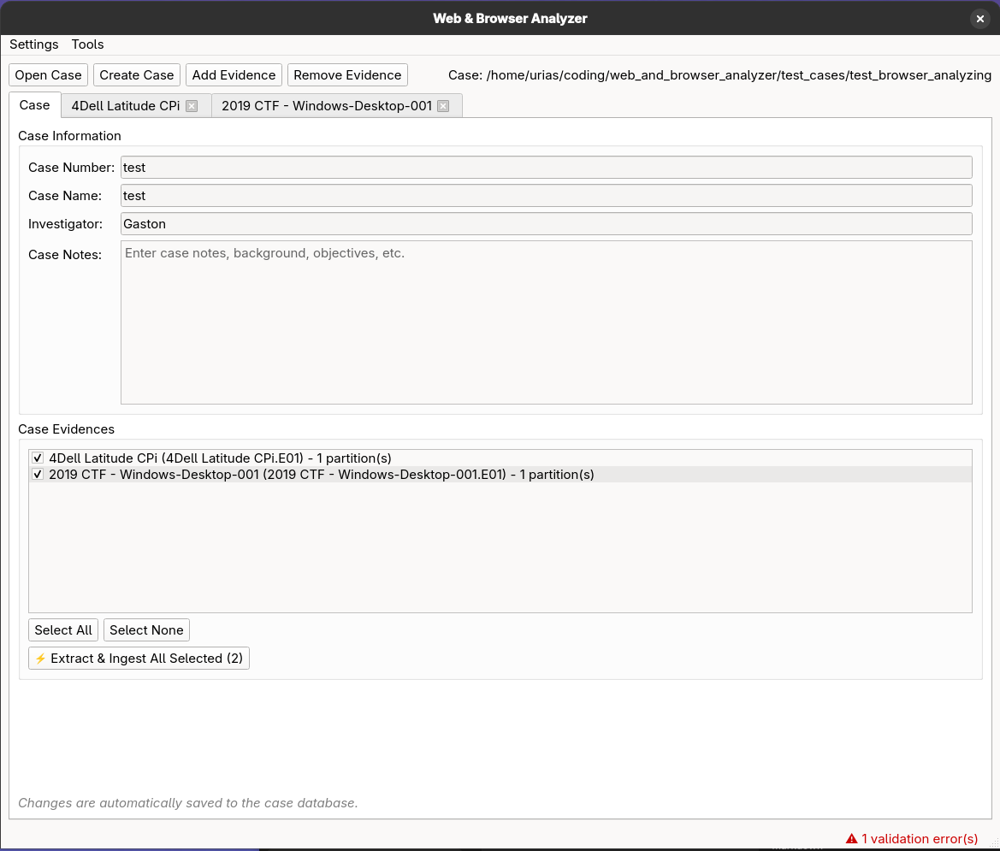

# Case Tab

## Purpose
- Displays case metadata and provides case-wide batch operations.
- Central starting point for managing the current case and its evidence items.

## When to use
- When reviewing or editing case details (case number, name, investigator, notes).
- When running extractors across multiple evidence items at once.

## Data sources
- Case database: case metadata and evidence list.

## Key controls
- **Case Number** — the case identifier.
- **Case Name** — descriptive name for the case.
- **Investigator** — name of the assigned investigator.
- **Case Notes** — multi-line text area for general case notes (auto-saved).
- **Evidence list** — all evidence items attached to this case.
- **Extract & Ingest All Selected** — batch operation to run extractors on multiple evidence items.

## Outputs
- Updated case metadata saved to the case database.
- Batch extraction/ingestion triggered across selected evidence items.

## Notes
- Changes to case metadata are auto-saved.
- For per-evidence extraction, use the Extraction tab within each evidence.
