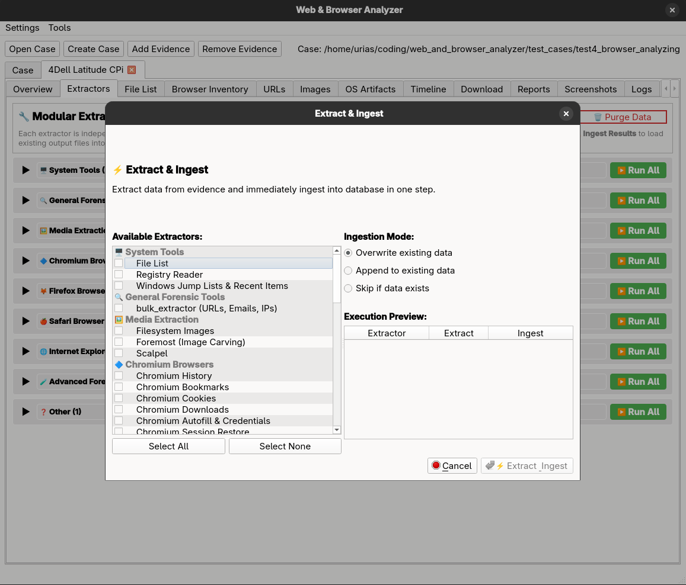

# Extraction (Tab)

## Purpose

- Modular extractor architecture with registry-based UI generation.
- Each extractor is a self-contained module with its own configuration UI, execution logic, ingestion logic, and status reporting.
- Documentation of each extractor you find in the section extractors.

## When to use

- When configuring and running extractors on an evidence item.
- When re-ingesting existing extractor outputs or purging ingested data.

## Data sources

- Evidence file system and extractor output folders.
- Case database for ingestion and run status tracking.

## Key controls

- Run All (batch extract + ingest) and Purge Data.
- Per-extractor Configure, Run Extraction, and Ingest Results actions.
- Status widgets showing run state and last results.

## Outputs

- Status reporting
- Extracted files written to the case folder.
- Ingested artifacts stored in the case database.

## Subtabs

- None

## Notes

- Modular extractor architecture with registry-based UI generation.
