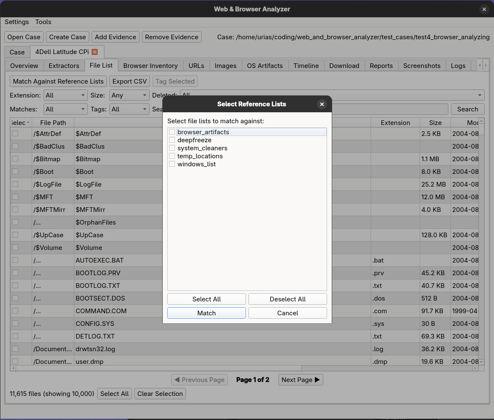

# File List (Tab)

File List Tab - UI for viewing and managing file list entries.

## Purpose
- Review file system entries extracted from evidence.
- Filter, tag, and match files against reference lists.

## When to use
- When you need to triage large file inventories by type, size, or path.
- When you want to tag or match files against known lists.

## Data sources
- Evidence database file_list table plus tag and match tables.

## Key controls
- Filters: extension, size, deleted status, matches, tags, and search.
- Actions: Match Against Reference Lists, Export CSV, Tag Selected.
- Pagination controls for large datasets.

## Outputs
- CSV export of the current filtered file list.
- Tag and match results stored in the case database.

## Subtabs
- None

## Notes
- Matching runs in the background; large lists may take time to process.
- Lists can be uploaded over settings - see the docs
